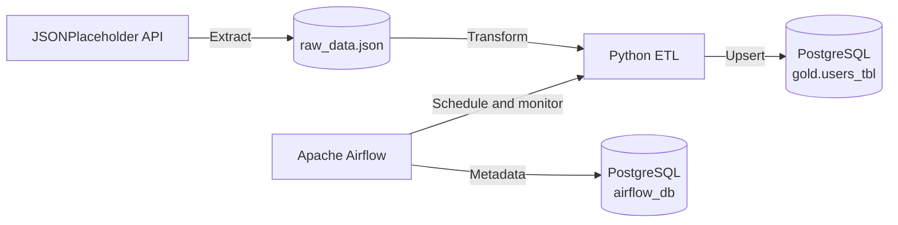

# API ETL Pipeline with Airflow and Docker

A containerized ETL pipeline that extracts user data from the JSONPlaceholder API, transforms nested records into a relational shape, and upserts them into PostgreSQL. Apache Airflow schedules and monitors the workflow, while Docker Compose provides a reproducible local environment.

## Architecture



The Compose stack contains two services:

- **PostgreSQL 18** stores both application data and Airflow metadata in separate databases.
- **Airflow 3.3** runs the scheduler, DAG processor, API server, and ETL task in standalone mode.

## Pipeline

The DAG runs hourly and performs the following operations:

1. Fetches users from `https://jsonplaceholder.typicode.com/users`.
2. Writes the source response to `data/raw_data.json`.
3. Flattens addresses and normalizes usernames, emails, and websites.
4. Creates the `gold.users_tbl` table when it does not exist.
5. Upserts records using `user_id` as the conflict key.

Failures are raised to Airflow using domain-specific exceptions, enabling task retries and accurate run states.

## Prerequisites

- Docker with Docker Compose v2
- Git

Python is only required when running the ETL outside Docker.

## Quick start

Clone the repository and enter the project directory:

```bash
git clone git@github.com:bayooyetoro/data-pipeline-airflow-docker.git
cd data-pipeline-airflow-docker
```

Create the local environment file:

```bash
cp .env.example .env
```

Replace every placeholder password in `.env` before starting the stack. The file is excluded from Git.

Start the services:

```bash
docker compose up -d
```

Check their health:

```bash
docker compose ps
```

Open the Airflow UI at [http://localhost:8000](http://localhost:8000) and sign in with `AIRFLOW_ADMIN_USERNAME` and `AIRFLOW_ADMIN_PASSWORD` from `.env`.

The DAG is named `api_etl_dag_orchestrator`. Enable or trigger it from the Airflow UI.

## Configuration

| Variable | Purpose | Example |
|---|---|---|
| `APP_DB_NAME` | Application database name | `db` |
| `APP_DB_USER` | Application database user | `db_user` |
| `APP_DB_PASSWORD` | Application database password | Set locally |
| `AIRFLOW_DB_NAME` | Airflow metadata database | `airflow_db` |
| `AIRFLOW_DB_USER` | Airflow metadata database user | `airflow` |
| `AIRFLOW_DB_PASSWORD` | Airflow metadata database password | Set locally |
| `AIRFLOW_ADMIN_USERNAME` | Airflow UI administrator | `admin` |
| `AIRFLOW_ADMIN_PASSWORD` | Airflow UI password | Set locally |

Docker Compose reads these values automatically from `.env`.

## Container initialization

PostgreSQL runs [`postgres/init-airflow.sh`](postgres/init-airflow.sh) the first time the named data volume is initialized. The script creates the dedicated Airflow database and role.

Airflow runs [`airflow/start-airflow.sh`](airflow/start-airflow.sh) every time its container starts. The script:

1. Creates the SimpleAuthManager password file from environment variables.
2. Applies Airflow metadata migrations.
3. Starts Airflow in standalone mode.

The PostgreSQL initialization script does not rerun against an existing data volume. To intentionally reset all local database data:

```bash
docker compose down -v
docker compose up -d
```

> **Warning:** `docker compose down -v` permanently deletes the local PostgreSQL volume.

## Database access

Connect to the application database from the PostgreSQL container:

```bash
docker compose exec postgres sh -c \
  'psql --username "$POSTGRES_USER" --dbname "$POSTGRES_DB"'
```

Inspect loaded users:

```sql
SELECT *
FROM gold.users_tbl
ORDER BY user_id;
```

## Logs and operations

Follow all service logs:

```bash
docker compose logs -f
```

Follow one service:

```bash
docker compose logs -f airflow
docker compose logs -f postgres
```

Stop the stack without deleting data:

```bash
docker compose down
```

## Project structure

```text
.
├── airflow/
│   ├── dags/orchestrator.py    # Hourly Airflow DAG
│   └── start-airflow.sh        # Airflow initialization and startup
├── data/                       # Extracted source data
├── postgres/
│   └── init-airflow.sh         # Airflow database initialization
├── src/api_etl/
│   ├── __main__.py             # Pipeline entry point
│   ├── custom_errors.py        # Domain-specific exceptions
│   ├── extract.py              # API extraction
│   ├── transform.py            # Record transformation
│   ├── load.py                 # PostgreSQL schema and upsert logic
│   └── utils.py                # Logging configuration
├── .env.example                # Required environment variables
├── docker-compose.yaml         # Local infrastructure
└── pyproject.toml              # Python package metadata
```

## Local Python execution

Install the package in a virtual environment:

```bash
python -m venv .venv
source .venv/bin/activate
pip install -e .
```

Export the application database variables before running locally. Unlike Docker Compose, Python does not automatically load `.env`:

```bash
set -a
source .env
set +a
export APP_DB_HOST=localhost
run-pipeline
```

PostgreSQL must already be running and accessible on port `5432`.

## Development checks

Validate the Compose configuration:

```bash
docker compose config --quiet
```

Check DAG import errors inside Airflow:

```bash
docker compose exec airflow airflow dags list-import-errors --local
```

List known DAGs:

```bash
docker compose exec airflow airflow dags list --local
```
